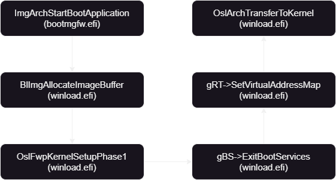
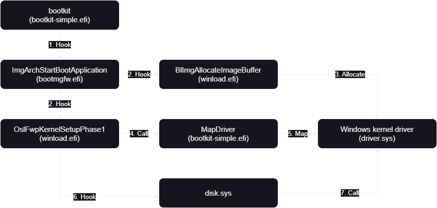
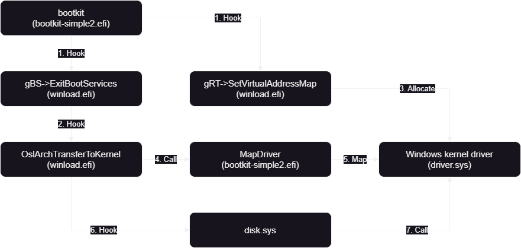

# bootkit-simple
Windows用のBootkitを作成した。
`ntoskrnl.exe`をロードする前にドライバをマッピングすることで、`DSE(Driver Signature Enforcement)`を回避ことが可能である。
このリポジトリは[btbd/umap](https://github.com/btbd/umap)と[memN0ps/bootkit-rs](https://github.com/memN0ps/bootkit-rs)を参考に実装している。

## 詳細

悪意のあるドライバをロードするためには以下が必要になる。

1. bootmgfw.efiをロード、実行
2. winload.efiのベースアドレスを取得
3. ドライバを書き込むための領域を確保
4. 確保した領域にドライバを書き込む
5. ターゲットモジュールをフック

| プロジェクト | フック関数 |
|:--|:--|
| bootkit-simple | ImgArchStartBootApplication</br>BlImgAllocateImageBuffer</br>OslFwpKernelSetupPhase1 |
| bootkit-simple2 | ExitBootServices</br>SetVirtualAddressMap</br>OslArchTransferToKernel |

プロジェクトでフックしている関数の呼び出しフローは以下になる。



1. bootmgfw.efi!ImgArchStartBootApplication : winload.efiを実行
2. winload.efi!BlImgAllocateImageBuffer : メモリバッファを確保
3. winload.efi!OslFwpKernelSetupPhase1 : 4,5の関数を実行
4. gBS->ExitBootServices : 全てのブートサービスを終了
5. gRT->SetVirtualAddressMap : ランタイムドライバを物理アドレスから仮想アドレスへ変換
6. winload.efi!OslArchTransferToKernel : winload.efiからカーネルへ移行する関数

### bootkit-simple



1. bootmgfw.efi!ImgArchStartBootApplication : Windows OSのローダ(winload.efi)が実行される関数。メモリがロードされているが、実行されていない。引数からwinload.efiがロードされたベースアドレスを得ることができる。
2. winload.efi!BlImgAllocateImageBuffer : 悪意のあるドライバのメモリ領域を確保する。
3. winload.efi!OslFwpKernelSetupPhase1 : OSカーネルやシステムドライバが一部ロードされているため、ntoskrnl.exeとdisk.sysのベースアドレスを取得し、悪意のあるドライバをロードする。


### bootkit-simple2



1. gBS->ExitBootServices : gBS->ExitBootServicesはwinload.efi!OslFwpKernelSetupPhase1から呼ばれるため、リターンアドレスを取得し、winload.efiのベースアドレスを見つける。
2. gRT->SetVirtualAddressMap : 物理アドレスから仮想アドレスに変換する関数であるため、gBS->AllocatePagesで確保した物理アドレスの仮想アドレスを取得する。
3. winload.efi!OslArchTransferToKernel : OSカーネルやシステムドライバが一部ロードされているため、ntoskrnl.exeとdisk.sysのベースアドレスを取得し、悪意のあるドライバをロードする。


## インストール手順

1. デスクトップ上にビルドしたefiファイルとinstall.batを設置する。
2. install.batを管理者権限で実行する。
3. 管理者権限のコマンドプロンプトを起動する。
4. 以下を実行する。
   ```cmd
   bcdedit.exe /set "{bootmgr}" path uefi.efi
   ```
5. 再起動する。


## デバッグ

### 1. bootmgr・winload・kernelをデバッグするコマンド
```
bcdedit /bootdebug "{bootmgr}" <on/off>  // bootmgr.efiデバッグ
bcdedit /bootdebug "{current}" <on/off>  // winload.efiデバッグ
bcdedit /debug <on/off>  // カーネルデバッグ
```

### 2. シリアルデバッグ出力

管理者権限のコマンドプロンプトで以下を実行することで、シリアル出力ができる。
```
bcdedit /dbgsettings serial debugport:1 baudrate:115200  // Set-VMComPortで設定したNumberとdebugportは同じにする必要がある
```

VM名が`win11`でパイプ名を`\\.\pipe\serial_1`に設定する場合
```
Set-VMComPort -VMName "win11" -Path "\\.\pipe\serail_1" -Number 1  // Hyper-Vにシリアルを設定
Get-VMComPort -VMname <vm name>  // Hyper-Vのシリアルを確認
```

PuTTYのCUIを使って、管理者権限のコマンドプロンプトに出力する。
```
plink.exe -serial \\.\pipe\serial_1 -sercfg 115200,8,1,N,N
```

### 3. WinDbg

前提として、「1. bootmgr・winload・kernelをデバッグするコマンド」でデバッグしたいターゲットを有効にする必要がある。

#### bootmgr

`OptionalHeader.ImageBase`にロードされるため、IDA Freeで解析したときにアドレスにブレークポイントをセットする。

#### winload


#### kernel

ターゲットモジュールのエントリーポイントをフックコマンド。
```
bu <TargetModule> + <RVA:EntryPoint>
```

プロジェクトでは`disk.sys`を使っており、このモジュールのエントリーポイントをフックする。
```
bu disk + 0x1080
```


## クレジット/参考
- https://github.com/pbatard/uefi-simple
- https://github.com/btbd/umap
- https://github.com/memN0ps/bootkit-rs
- https://github.com/Cr4sh/s6_pcie_microblaze
- https://github.com/RobinFassinaMoschiniForks/bootdoor/tree/master
- http://blog.leanote.com/post/only_the_brave/Windows%E5%88%9D%E5%A7%8B%E5%8C%96%E8%BF%87%E7%A8%8B-%E4%BA%8C

## 開発メンバー
- Cha1aza([Twitter](https://twitter.com/Cha1aza), [GitHub](https://github.com/cha1aza))
- mi2([Twitter](https://twitter.com/3ts75), [GitHub](https://github.com/3ts75))
- ry0kvn([Twitter](https://twitter.com/ry0kvn), [GitHub](https://github.com/ry0kvn))
